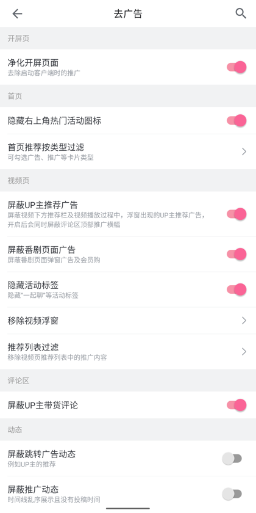
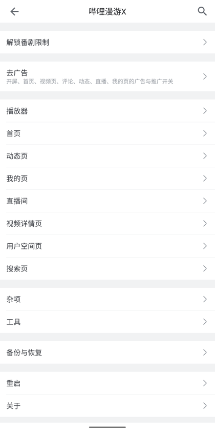

<div align="center">


# Bilibili Clean

[](https://github.com/fzc2000/bilibili-clean/releases)
[](https://github.com/BiliRoamingX/BiliRoamingX/tree/58aaf27)
[](./VERIFY_REPORT.md)

> ✨ 基于 BiliRoamingX 二次开发 — 去广告，以及从 Evolved 搬来的实用功能

📝 **[下载发布版本](https://github.com/fzc2000/bilibili-clean/releases)** | ❤️ **[赞助](./SPONSOR.md)** | 🧩 **[BiliRoamingX](https://github.com/BiliRoamingX/BiliRoamingX)**

_我只是想安安静静看个视频._

</div>

---

## 为什么做这个

因为我受不了开屏广告，虽然我知道这是B站的很大一部分收益来源。但 这和我又有什么关系呢？

## 特性

### 广告与体验

- 🧹 **去广告归拢** — 散落各页面的开关收进一个分类，一眼找到；8.92.1 开屏品牌广告走 Gson，老补丁看不见，HTTP 层直接拦
- 🔇 **直播首页不自动播** — 进 tab 不会被突然冒出来的声音吓到，想看自己点

### 效率工具

- 🗑️ **批量删除动态** — 网页端删除接口经常 412，改走 App 的 gRPC
- 📑 **记忆合集进度** — 追番看到第几集会记着，下次从第 1 集进去自动跳到上次位置

### 日常增强

- 📂 按关注分组筛动态
- ⏱️ 显示关注时间
- ✅ 看完自动移出「稍后再看」
- ▶️ 连续播放同 UP 视频
- ⏭️ 跳过充电鸣谢
- 📖 自动展开简介
- 🔤 自定义字体
- 🌙 夜间模式定时

> 以上均已在真机上验证，结论见 [VERIFY_REPORT.md](./VERIFY_REPORT.md)

## 截图

| 直播  | 去广告 |
|:-:|:-:|:-:|
|  |  | 
| 漫游设置：新加的「去广告」分类 |
|:-:|
|  |

## 快速开始

前往 **[Release](../../releases)** 下载最新 APK 安装即可。

> [!IMPORTANT]
> 签名和官方不一样，**安装前需要先卸载官方版**。之后升级只认这里发的包，签名一致才能覆盖安装。

## 自己编

<details>
<summary>📝 展开编译指南</summary>

#### 前置条件

- JDK 21
- Android SDK（带 NDK 和 cmake）
- 能读 BiliRoamingX GitHub Packages 的令牌
- 官方 B 站 8.92.1 APK（自己找，这里不放）

#### 步骤

```bash
git clone https://github.com/BiliRoamingX/BiliRoamingX.git
cd BiliRoamingX && git checkout 58aaf27
git apply ../local-changes.diff
cp -R ../new-files/. .
GITHUB_ACTOR=你的用户名 GITHUB_TOKEN=你的令牌 ../build-and-patch.sh
```

#### 仓库文件

| 文件 | 说明 |
|---|---|
| `local-changes.diff` | 对上游 `58aaf27` 已有文件的改动 |
| `new-files/` | 新加的文件，目录结构跟上游一致，整个覆盖过去 |
| `build-and-patch.sh` | 编译 → 打补丁 → 签名一条龙 |
| `VERIFY_REPORT.md` | 真机验证结论 |

> keystore 不在仓库里，别翻了。

</details>

## 已知问题

- 记忆合集进度只认「整个合集的第 1 集」，分季合集从某一季的第 1 集进不会跳转
- 批量删除动态的「删」没真跑过——我号上没什么可删的
- 两个测试项因账号未关注相关 UP 主，只验到入口，详见报告

## 贡献者

- [@fzc2000](https://github.com/fzc2000) — 提需求、真机测、拍板
- Claude（Anthropic）— 定位失效补丁、写代码、搭测试脚本

## Thanks

底子全是别人的，我只是站在上面加了点东西：

- [BiliRoamingX](https://github.com/BiliRoamingX/BiliRoamingX) — 补丁框架和大部分去广告能力
- [Bilibili-Evolved](https://github.com/the1812/Bilibili-Evolved) — 功能思路的来源
- [ReVanced](https://github.com/ReVanced) — 打补丁的工具链

---

<div align="center">
<sub>自用项目，图个清净。B 站客户端的一切权利归 B 站。不分发官方 APK，不对使用后果负责。</sub>
</div>
